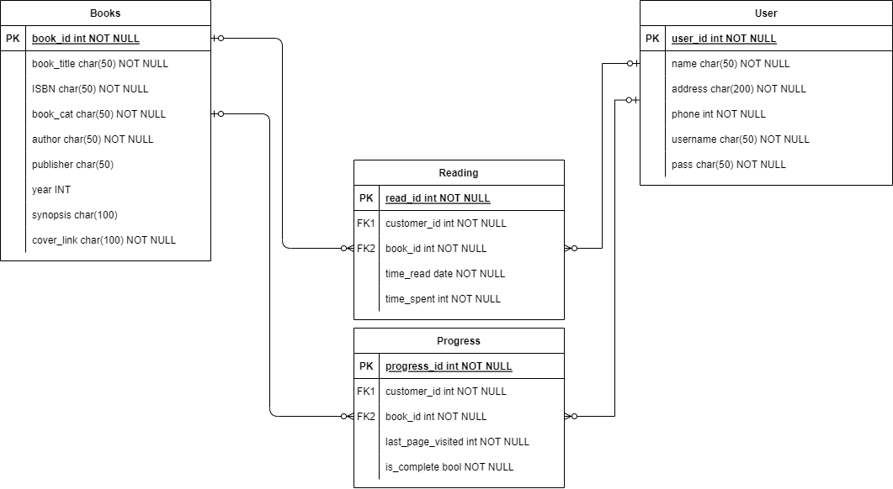

# Readify

Discover your next favorite book

Kelompok Librarians

## Anggota Kelompok 

|Nama|NIM|
|---|---|
|Ahmad Yazid Naufan|20/460537/TK/51126|
|Khalid Rizki Ananta|20/460548/TK/51137|
|Adrian Syah Abidin|20/463588/TK/51580|

## Tujuan
Tujuan dari Readify adalah untuk menyediakan aplikasi perpustakaan digital yang mudah diakses dan memudahkan penggunanya dalam membaca buku digital, terutama yang berbahasa Indonesia. Dengan adanya aplikasi ini, diharapkan masyarakat dapat dengan mudah mengakses dan membaca berbagai macam buku digital tanpa perlu mengunjungi perpustakaan fisik. Selain itu, aplikasi ini juga membantu memperluas akses ke berbagai sumber literatur yang berharga, termasuk buku bahasa Inggris dan asing. Dengan demikian, Readify memiliki tujuan untuk meningkatkan minat baca masyarakat dan membantu mereka meningkatkan pengetahuan dan wawasan.

## Metodologi
### Kanban
#### ALasan Pemilihan
Kami memilih kanban karena framework tersebut memberikan visual yang mudah bagi tim untuk melihat perkembangan progres aplikasi. Tim akan lebih mudah dalam mengindentifikasi bottleneck dan area-area yang mengalami hambatan sehingga tim pun dapat dengan cepat mengatasinya. Selain itu, kanban juga berfokus pada continuous delivery sehingga tiap fitur atau perubahan dapat diuji sebelum di-deploy. Terakhir, Kanban mendukung kolaborasi di antara anggota tim karena tiap anggota dapat melihat apa yang dikerjakan oleh orang lain.

## Pengguna Potensial 
Beberapa pengguna potensialnya adalah sebagai berikut:

1. Penggemar buku: Pengguna yang gemar membaca buku, baik itu buku berbahasa Indonesia maupun buku berbahasa Inggris dan asing. Kebutuhan mereka adalah akses mudah dan cepat untuk membaca buku digital dengan berbagai macam genre.
2. Pelajar dan mahasiswa: Pengguna yang membutuhkan referensi atau bahan bacaan untuk keperluan akademis, seperti tugas, makalah, dan skripsi. Kebutuhan mereka adalah akses ke buku-buku akademis dan referensi secara mudah dan cepat.
3. Pekerja: Pengguna yang ingin mengembangkan keterampilan dan pengetahuan di bidang kerja mereka. Kebutuhan mereka adalah akses ke buku-buku yang terkait dengan bidang kerja mereka, seperti manajemen, bisnis, teknologi, dan sebagainya.
4. Anak-anak dan remaja: Pengguna yang ingin membaca buku-buku cerita atau buku pelajaran untuk anak-anak dan remaja. Kebutuhan mereka adalah akses ke buku-buku yang sesuai dengan usia dan minat mereka.

## Wireframe

* [Lo-Fi](https://www.figma.com/file/fAfsJ8Xpxx0D1LNCborbYl/LOW-FI-ReadyFI?node-id=0%3A1&t=AUyjNOTRi6EZYf2x-1)
* [Hi-Fi](https://www.figma.com/file/fAfsJ8Xpxx0D1LNCborbYl/ReadyFI?node-id=30%3A263&t=nLDv8WTel0MZeyZG-1)

## Use-Case Diagram

 

## Entity Relationship Diagram

## Gantt Chart

# API Documentation

## Base URL

>`https://{deployment-url}/api/v1/`

this API will be divided into 2 section, which is for admin API and for general user API

-----

## Admin API Endpoint

-----

### GET `/user`

this will return all user with their encrypted password and their data.

request :

    GET /user

response :

    asdasd

error :

    asdasda

### GET `/user/:id`

this will return user by selected `:id`

request :

    this is req

response :

    asdasd

error :

    asdasda

### POST `/books`

-----

## General User API Endpoints

-----

### POST `/register/user/`

request :

    this is req

response :

    asdasd

error :

    asdasda

### POST `/login`

request :

    this is req

response :

    asdasd

error :

    asdasda

### GET `/recommendation`

request :

    this is req

response :

    asdasd

error :

    asdasda

### GET `/books`

request :

    this is req

response :

    asdasd

error :

    asdasda

### GET `/books/:id`

request :

    this is req

response :

    asdasd

error :

    asdasda

### GET `/books/content/:id`

request :

    this is req

response :

    asdasd

error :

    asdasda

### POST Reading List book(s) by `:id`

request :

    this is req

response :

    asdasd

error :

    asdasda

### PUT/EDIT Reading List Book(s) by `:id`

request :

    this is req

response :

    asdasd

error :

    asdasda

### DELETE Reading List Book(s) by `:id`

request :

    this is req

response :

    asdasd

error :

    asdasda

## DELETE

